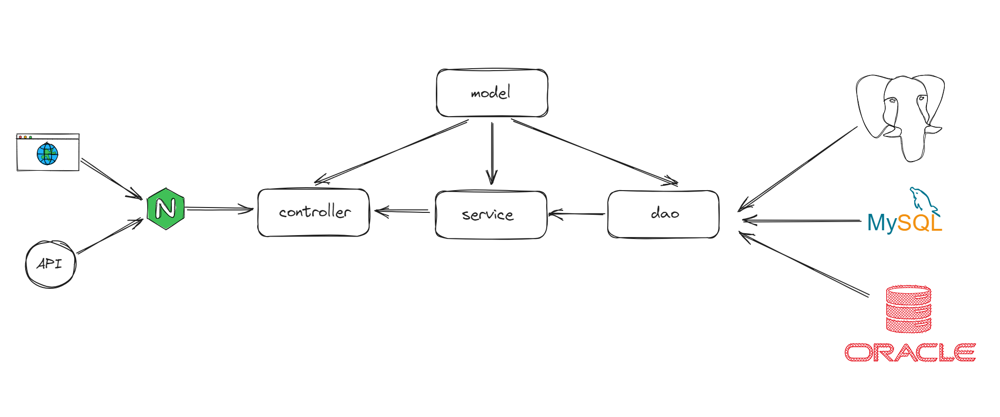

# skylark

<h1 align="center">
  
</h1>
skylark是沈阳师范大学软件学院sky工作室开发的社区论坛项目，该项目致力于服务全校同学。我们希望打造一个集学习、分享、社交、娱乐等功能于一体的统一平台

## 技术栈
**前端:** [vue](https://github.com/vuejs/vue)

**后端:** [hertz](https://github.com/cloudwego/hertz)、[viper](https://github.com/spf13/viper)、MySQL、[Redis](https://github.com/redis/redis)、Docker

## 架构

## 快速开始

Clone本项目

```bash
  git clone https://github.com/cold-runner/skylark.git
```

前往项目目录，将conf.example.yaml中的内容修改成你自己的，然后重命名`conf`目录下的`conf.example.yaml`文件为`conf.yaml`

```bash
  cd skylark && mv conf/conf.example.yaml conf/conf.yaml
```

安装依赖

```bash
  go build
```

启动服务器

```bash
  ./skylark
```


## 路线图

- [x] 手机验证码发送
- [x] 注册
- [x] 实现日志器
- [ ] 实现工厂模式、单例模式创建依赖；使用代理模式给配置对象增加校验逻辑
- [ ] 限流、认证中间件
- [ ] 鉴权
- [ ] 处理软件学院新生报名
- [ ] 后台管理系统
- [ ] 用户个人信息修改
- [ ] 论坛版块
- ……

- ……

## 贡献者
[@huaiyu](https://www.github.com/cold-runner) 

[@0deity0](https://github.com/0deity0)

[@Dayu2218](https://github.com/Dayu2218)

[@dreame2003](https://github.com/dreame2003)

[@李苏恒](https://github.com/lisuheng1)

[@xiaoyushashasha](https://github.com/xiaoyushashasha)

[@1459122342](https://github.com/1459122342)
